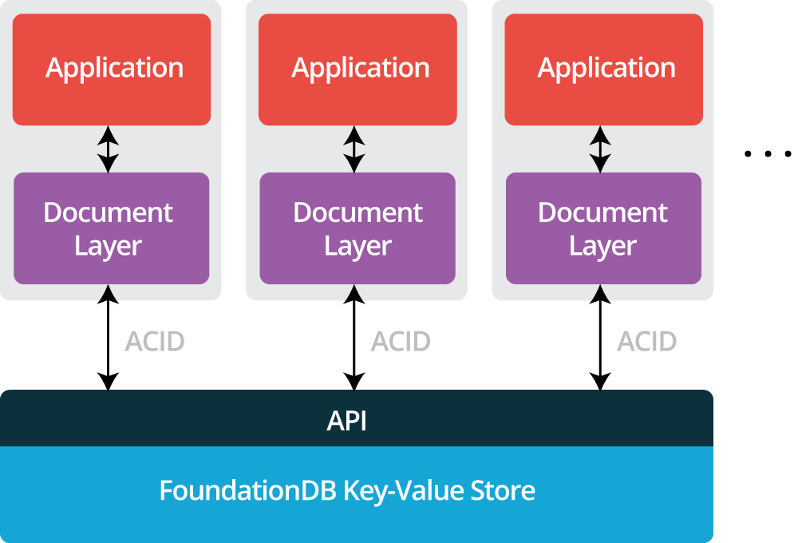

# Architecture

The Document Layer is a stateless microserver backed by FoundationDB
Key-Value Store. All the persistent state (documents, indexes, metadata,
etc.) are stored in the Key-Value store. The Document Layer speaks the
MongoDB® wire protocol, allowing the use of the MongoDB® API via
existing MongoDB® client bindings.

Since the Document Layer is stateless, scalability and fault-tolerance
at the data model/translation tier can be provided either through each
client running a local instance for each app server (as shown above), or
by load-balancing requests across a pool of Document Layer instances. The
storage tier is
[scalable](https://apple.github.io/foundationdb/performance.html) and
[fault-tolerant](https://apple.github.io/foundationdb/fault-tolerance.html)
due to the Key-Value Store already possessing those properties. This results
in easy scaling and graceful fault-tolerance for the entire architecture.

The Document Layer implements a subset of the MongoDB® API (v3.0.0) with some [differences](known-differences.md). It will also work
with all of the latest drivers because the MongoDB® drivers are
backward compatible with 3.0.0. All logic related to query-planning,
logical-to-physical mapping, and indexing are independent of the
MongoDB® protocol emulation. This enables the Document Layer to be a 
general document database that exposes the MongoDB® API as one
possible interface.

## Architectural advantages

Here is a selection of fundamental design advantages of the Document
Layer over MongoDB®.

### No write locks

The Document Layer does not implement locks on the database for write
operations. The Key-Value Store uses optimistic concurrency control
instead of locking. In some cases, operations may have to retry due to
conflicts; non-conflicting operations, including metadata
operations, can always proceed in parallel on the same instance.

### No sharding

The Document Layer does not rely on sharding with a fixed shard key to
distribute data. Instead, all data partitioning and rebalancing is
handled automatically by the Key-Value Store and is transparent to the
client application. This approach provides robust horizontal scalability
while avoiding the client-level complexity.

### Memory management

Both the Document Layer and the Key-Value Store have predictable memory
usage.

### No config servers or mongos routers

There are no config servers or `mongos` routers. Cluster topology remains
uniform as the overall application deployment changes.

### Safe behavior

By default, write operations on the Document Layer execute with
document-level isolation and atomicity. Unsuccessful operations are
reported to the client, rather than failing silently after execution.
Indexes are always consistent with inserts and updates as they are
written together in a FoundationDB transaction. Write concern and Read
preference do not matter as writes are fully consistent
irrespective of write concern. Reads always see causal consistency.

### No table compaction

The Document Layer does not need to perform offline table compaction,
which incurs unnecessary overhead.
